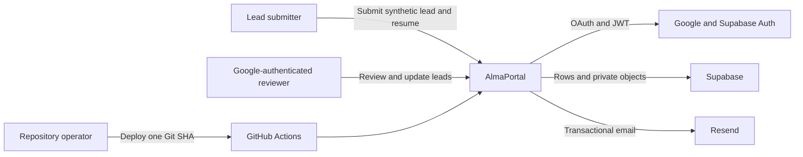
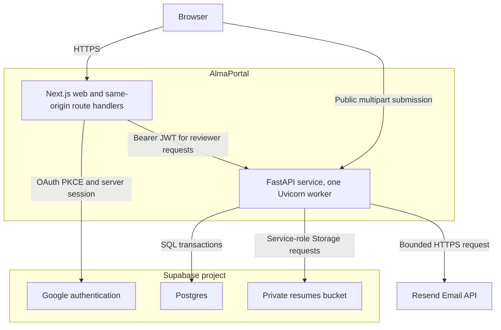
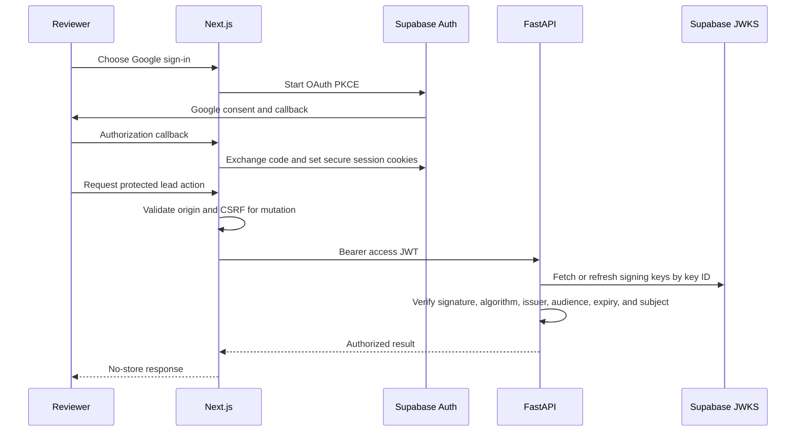
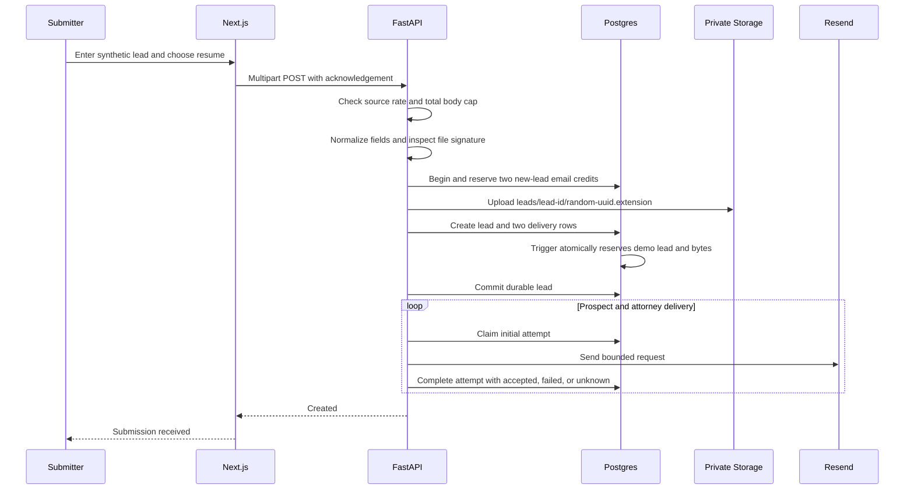
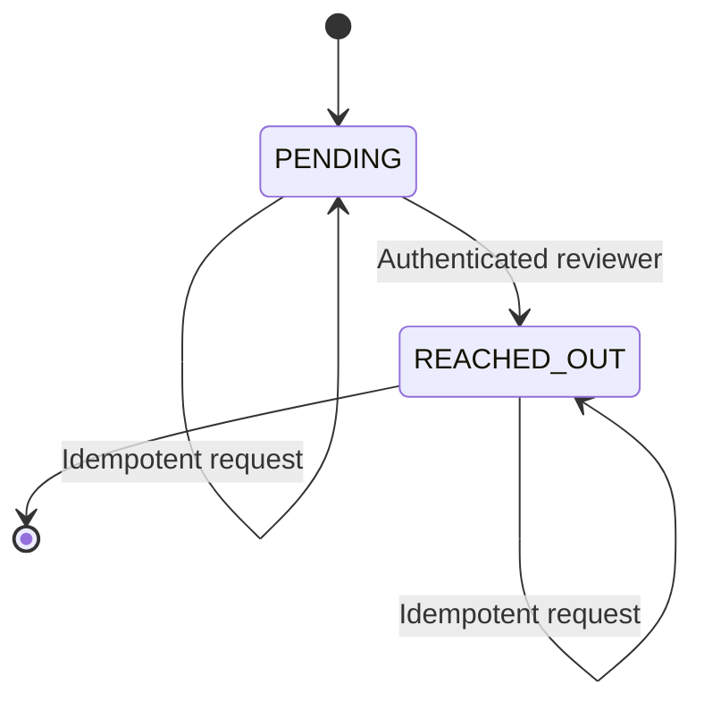
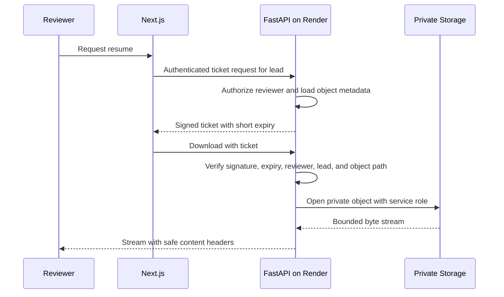
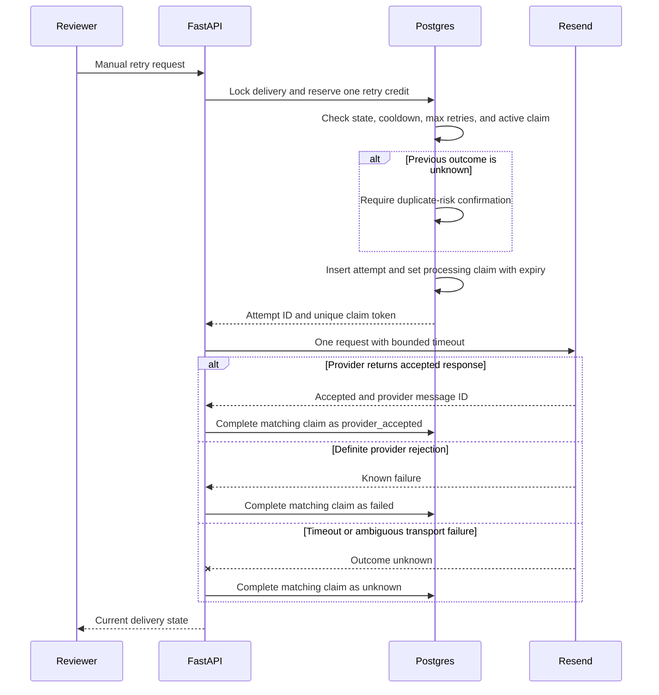

# AlmaPortal system design

This is the take-home design document: why the boundaries exist, which
tradeoffs were accepted, and how the local and hosted paths are supposed to
behave. For the short evaluator runbook see
[local-setup.md](local-setup.md).

## 1. Scope

AlmaPortal is a take-home system for synthetic lead intake and reviewer
follow-up. It is not approved to process real PII.

Functional requirements:

- Accept a first name, last name, email address, synthetic-data
  acknowledgement, and one synthetic PDF, DOC, or DOCX resume.
- Persist the lead and private resume, then attempt a prospect confirmation and
  an attorney notification.
- Let a Google-authenticated reviewer search and inspect leads.
- Let a reviewer move a lead from `PENDING` to `REACHED_OUT`.
- Let a reviewer obtain a short-lived ticket and download a resume through the
  API without exposing a reusable private object URL.
- Show each delivery state and permit bounded manual retries for failed or
  unknown attempts.
- Expose health and exact source-version endpoints for deployment verification.

Operational and safety requirements:

- Accept synthetic data only. Enforce an explicit acknowledgement at the UI
  and API.
- Keep credentials and provider keys out of the browser, repository, logs, and
  API responses.
- Bound request size, upload expansion, public submission rate, total demo
  leads and bytes, and split daily email credits.
- Make state transitions and email claims safe under concurrent requests.
- Deploy migrations, API, and web in that order from one Git commit.
- Avoid automatic real-email retries in the free assessment environment.

## 2. System context

The lead submitter is unauthenticated. Reviewer actions require a valid
Supabase session. In the hosted assessment, any Google account is accepted as a
reviewer so an evaluator can test without waiting for an allowlist change.
That is an access workaround, not an acceptable production authorization rule.

## 3. Containers

Vercel hosts Next.js. Render hosts FastAPI because Supabase is a database, Auth,
Storage, and edge-function platform. Supabase cannot host the required Python
FastAPI process. Render starts one Uvicorn worker because the assessment's
public request limiter is process-local.

## 4. Major decisions

### Next.js on Vercel

Next.js supplies the public form, authenticated reviewer pages, and
same-origin route handlers. Protected browser requests use those handlers, so
application code does not copy Supabase access tokens into local storage or
long-lived client state.

### FastAPI on Render

The API owns validation, authorization, domain transitions, database
transactions, private Storage access, ticket signing, and Resend calls. One
service keeps policy out of the browser and gives file streaming a clear trust
boundary.

### Supabase for managed state

Postgres is the concurrency authority. Supabase Auth issues reviewer JWTs.
Supabase Storage holds resumes in a private bucket. FastAPI connects to
Postgres as the least-privilege `alma_api` role and uses the Supabase
service-role key only for server-side Storage. Every API operation still
performs object-level authorization.

### Open Google authentication for reviewer access

The hosted take-home permits any valid Google-authenticated Supabase user to
use reviewer endpoints. This was selected so evaluators can test immediately,
without sharing their addresses in advance or waiting for an allowlist
deployment.

Authentication without reviewer authorization is intentionally unsafe for
real PII. Production must check an organization domain, an administrator-owned
allowlist, or a reviewer role in FastAPI on every protected request. A hidden
navigation item or client-side email check is not authorization.

### Synchronous attempts and manual retry

After durable lead creation, the API claims and sends the two initial emails.
An individual send failure does not roll back the lead or resume. There is no
automatic retry scheduler.

Free Render services sleep while idle, so they cannot run a dependable
in-process timer or worker. A durable queue plus always-on worker would add
paid infrastructure solely for a take-home. Failed and unknown attempts are
therefore retried manually. Unknown outcomes require the reviewer to confirm
the risk of a duplicate before retrying.

### Resend Email API

Resend can send assessment mail after an API key exists. The test sender
`onboarding@resend.dev` can reach only the Resend account owner. Arbitrary
prospect and attorney inboxes require a verified domain. The provider's daily
allowance can be exhausted or changed. AlmaPortal applies a lower
database-backed daily budget as a cost and abuse guard.

Production fixes `RESEND_BASE_URL` to `https://api.resend.com`. Only local,
isolated tests replace that origin with a Resend-compatible capture server.

`provider_accepted` means Resend accepted the API request. It is not evidence
that the recipient server accepted the message or that it reached an inbox.

## 5. Module boundaries

### `apps/web`

- `app/` owns pages, layouts, callback handling, and same-origin route
  handlers.
- `components/` owns accessible forms, lead views, status controls, and error
  states.
- `lib/supabase/` owns browser and server Supabase client construction.
- `lib/` owns typed API calls, validation schemas, and small presentation
  helpers.
- Browser code may use only public API, Supabase URL, and anon-key values.

### `apps/api`

- `domain.py` contains provider-free entities, value objects, states, and
  transition rules.
- `application.py` coordinates use cases through repository, Storage, mail,
  clock, and ticket ports.
- `documents.py` validates bounded PDF, DOC, and DOCX content.
- HTTP modules translate requests, JWT principals, use-case results, and
  problem responses.
- Adapter modules implement Postgres, Supabase Storage, Resend, JWT/JWKS, and
  signed-ticket ports.
- `config.py` validates environment settings and refuses unsafe wildcard CORS
  or multi-worker configuration. It also requires the public API origin used
  in absolute download URLs and restricts provider origins to HTTPS in
  production.

Domain and application code do not import FastAPI, SQLAlchemy, Supabase, or
Resend types. Adapters depend inward on ports. HTTP code invokes use cases
instead of issuing provider calls directly.

### `infra/supabase`

Ordered SQL migrations own tables, constraints, indexes, RLS, Storage policy,
and transactional claim and budget functions. Application startup never calls
`create_all`.

### `tests`

Unit tests cover domain and adapter behavior. Integration tests use local
Supabase and a Resend stub. Hosted smoke tests are read-only and never submit
a lead or send mail.

## 6. Data model

### `leads`

Stores the normalized lead and resume metadata:

- `id`
- bounded `first_name`, `last_name`, and `normalized_email`
- optional `comments`, stored as null when omitted or blank
- private `resume_object_path`, sanitized `original_filename`,
  `detected_media_type`, and `byte_size`
- `status`, constrained to `PENDING` or `REACHED_OUT`
- `created_at` and `updated_at`
- immutable reached-out audit fields: timestamp, reviewer user ID, and reviewer
  email

Duplicate lead email addresses are allowed. Cursor indexes use
`(created_at, id)`, with supporting status and normalized-email indexes.
Each object path is generated as
`leads/{lead_id}/{uuid-v4}.{pdf|doc|docx}`. The random UUID is separate from the
sanitized original filename.

### `email_deliveries`

Contains one row per lead and delivery kind. The two kinds are prospect
confirmation and attorney notification. A unique constraint prevents duplicate
delivery projections for the same lead and kind.

The row stores current state, recipient, active attempt identity and claim
token, claim expiry, attempt counts, last attempt time, sanitized last error,
and provider message ID. It is the fast current-state projection.

### `email_delivery_attempts`

Contains the append-only history of initial and manual attempts. It records:

- attempt and delivery IDs
- a unique claim token and monotonically increasing attempt number
- initial or manual trigger
- reviewer identity for a manual retry
- start and end timestamps
- HTTP status when known
- provider message ID for an accepted request
- outcome and sanitized error

Claim identity is immutable. A completed attempt is immutable. Uniqueness on
delivery and attempt number plus a one-initial-attempt constraint supports
auditing and idempotent claims.

### Budget and capacity tables

- `daily_email_budgets` defaults to 80 new-lead credits and 20 manual-retry
  credits per UTC day.
- `email_budget_reservations` gives each reservation an idempotency key.
- `demo_capacity` atomically caps total assessment lead count and stored resume
  bytes.

One accepted lead reserves two initial email credits. A manual retry reserves
one retry credit inside the claim transaction. These values are owned by
Postgres migrations and rows, not Render environment variables. The database
is authoritative when concurrent requests race.

### Supabase Storage

The `resumes` bucket is private. Postgres stores only an object path, never a
public or signed object URL. Objects follow the random lead-bound path above.
Browser roles have no direct read policy.

## 7. API contracts

All JSON responses use UTF-8. Errors use a stable machine-readable `code` and a
safe human message. Validation responses never include provider secrets,
database text, object keys, or raw Resend bodies.

### Public

`GET /health/live`

- Returns `200` when the process can accept requests.
- Contains no credential or infrastructure detail.

`GET /health/ready`

- Returns `200` only when the connection reports the `alma_api` runtime
  identity, the required schema functions and grants are present, and the API
  can perform its intended database access.
- Render uses this endpoint for its service health check.

`GET /version`

- Returns `{"commit_sha":"<git-sha>"}`.
- On Render, the value comes from `RENDER_GIT_COMMIT`, with `COMMIT_SHA` as the
  local or non-Render fallback.
- Production deployment fails unless it exactly equals the `RELEASE_SHA`
  obtained from the successful CI workflow run.

`POST /api/v1/leads`

- Accepts `multipart/form-data`.
- Fields are `first_name`, `last_name`, `email`,
  `synthetic_data_acknowledged`, `resume`, and optional `comments` (at most
  2,000 characters).
- Accepts one signature-validated PDF, DOC, or DOCX up to 10 MiB.
- Returns `201` after the lead and resume are durable. Initial delivery states
  are visible through the protected lead resource.
- May return `413` for body or file size, `422` for invalid data, or `429` for
  per-source throttling and exhausted assessment capacity.

### Reviewer-authenticated

The protected route family is versioned under `/api/v1`. The canonical
resources are:

- `GET /me` for the validated reviewer identity.
- `POST /leads/search` with `q`, `status`, `cursor`, and `limit` for stable
  cursor pagination.
- `GET /leads/summary` for pending, reached-out, and total counts.
- `GET /leads/{lead_id}` for lead, current delivery projections, and append-only
  attempt history.
- `PATCH /leads/{lead_id}/status` with `{"status":"REACHED_OUT"}`.
- `POST /leads/{lead_id}/resume-download` for a roughly 60-second signed ticket.
- `POST /leads/{lead_id}/deliveries/{delivery_id}/retry` with
  `{"duplicate_risk_confirmed":true|false}`.

Protected mutations require a same-origin CSRF token at the Next.js boundary
in addition to the Supabase session. FastAPI independently requires a bearer
JWT and object-level authorization.

`GET /api/v1/downloads/resume?ticket=<ticket>` is authorized by the signed,
short-lived ticket rather than a JWT. It streams the private object through
Render.

`PUBLIC_API_URL` is the exact public FastAPI origin. The ticket-creation
response uses it to return an absolute download URL, which the web client
checks against `NEXT_PUBLIC_API_URL`.

## 8. Authentication and JWT flow

Hosted JWT validation accepts only configured asymmetric algorithms. It
verifies the Supabase issuer, `authenticated` audience, expiry, and UUID
subject. JWKS keys are cached for a bounded time and refreshed on an unknown
key ID to support rotation. Local Supabase CLI sessions use genuine HS256
tokens, so a separate shared-secret verifier is allowed only with a loopback
Supabase origin outside production. The API does not trust profile fields or
an email sent by the browser.

Cookies use Secure, HttpOnly, and SameSite settings in production. Reviewer
pages and API route-handler responses use `Cache-Control: private, no-store`.
CORS contains exact web origins and never `*`.

## 9. Lead submission flow

If Storage succeeds but the database transaction fails, the API attempts to
delete the orphan object and logs a redacted compensation failure if cleanup
also fails. The storage audit command detects leftovers for manual removal.
Once the lead commits, mail failure never deletes the submission.

## 10. Lead status flow

No transition returns a reached-out lead to pending. Postgres locks the lead
row during mutation. The database constraint and trigger enforce the same
one-way transition and make reached-out audit fields immutable.

Two reviewers can submit the same transition. The first writes the reviewer
audit. The second receives the already-reached-out state and cannot replace
that audit.

## 11. Private resume download

The ticket is an HMAC-signed capability containing reviewer ID, lead ID,
private object path, and expiry. Its secret is at least 32 random bytes and
exists only on Render. The assessment ticket is short-lived but can be replayed
until expiry. Production should store a ticket digest and atomically consume it
for one-time use when replay resistance is required.

The API validates that the path belongs to the authorized lead before signing.
It sets a sanitized attachment filename, a known media type,
`X-Content-Type-Options: nosniff`, private no-store caching, and no inline
rendering. Render streams the bytes and does not return a Supabase signed URL.
A sleeping free Render service can delay the first ticket or download request.

## 12. Upload defense

Client extension and size checks provide quick feedback but are not trusted.
FastAPI applies:

- A 12 MiB overall request-body cap before multipart parsing.
- A 10 MiB resume cap.
- Exact field count and bounded normalized names and email.
- Required synthetic-data acknowledgement.
- Signature detection for `%PDF-`, OLE DOC, and ZIP-based DOCX.
- DOCX required-entry checks, no encrypted entries, no absolute or parent
  paths, at most 256 entries, at most 50 MiB expanded content, and a bounded
  compression ratio.
- A server-generated private object path and sanitized display filename.
- No parser execution, macro execution, inline browser display, or email
  attachment.

Signature checks are not malware scanning. Production should upload into
quarantine, scan with an isolated service, reject password-protected documents,
and release only clean objects. Consider converting accepted documents to a
safe derived PDF while retaining the original only when policy allows.

## 13. Rate and capacity limits

The public submission route allows 60 requests per source over a rolling
15-minute window by default. The source is the direct peer address unless the
peer belongs to `TRUSTED_PROXY_CIDRS`, in which case a validated forwarded
address may be used. This avoids accepting arbitrary spoofed forwarding
headers.

For Render, configure `TRUSTED_PROXY_CIDRS` from Render's current proxy
documentation before treating the source key as a client IP. If Cloudflare is
placed in front, its edge must normalize `CF-Connecting-IP` into the trusted
forwarding chain. The API must never accept `CF-Connecting-IP` directly from an
untrusted peer. The exact production proxy CIDRs and header path are deployment
configuration, so source-based throttling is not complete until operators
verify both.

The assessment limiter is in memory. `WEB_CONCURRENCY=1` is required and
validated at startup. A restart clears the short window, so Postgres capacity
limits remain the durable abuse and cost backstop.

The database atomically enforces:

- A 200-lead total demo cap by default.
- A 500 MiB total resume cap by default.
- An 80-credit UTC daily new-lead pool, using two credits per submission.
- A 20-credit UTC daily manual-retry pool, using one credit per retry.

Production should move source throttling to a shared edge or Redis-compatible
store, add account and device signals, and return a consistent `Retry-After`.
IP-derived keys should be keyed hashes with a rotating secret if persisted.

## 14. Email attempt claim protocol

A reviewer delivery action has two modes. For a delivery still in `pending`, it
claims and sends the original attempt with trigger kind `initial`; this recovers
an initial send that did not start after lead creation. For a terminal `failed`
or `unknown` delivery, the same reviewer action follows the manual-retry rules
and uses retry budget. It never silently creates a second initial attempt.

Claim rules:

1. Lock the delivery row.
2. Reject a retry when the delivery is already `provider_accepted`, the
   five-retry limit is reached, the one-minute cooldown remains active, or a
   live claim exists.
3. Reserve the retry budget and insert an append-only attempt in the same
   transaction.
4. Put a unique token and five-minute lease on the delivery projection.
5. Commit before calling Resend.
6. Complete only when delivery ID, attempt ID, and claim token still match.
7. Clear the active claim and record a sanitized terminal result.

Before confirmation or retry, an expired `processing` lease is committed as an
append-only `unknown` attempt and the delivery projection is durably updated to
`unknown`. The reviewer then sees the ambiguous result and must explicitly
confirm duplicate-send risk in a later retry request. A rollback or validation
response cannot erase that reconciliation.

The token prevents a late completion from overwriting a newer attempt. Unique
constraints prevent two initial claims or two identical attempt numbers.

Resend success is represented as `provider_accepted`, not `delivered`.
Definite validation or authorization rejection is failed. A timeout, connection
reset after request transmission, or process death around the provider call is
unknown because the provider may have accepted the message.

## 15. Concurrency and failure handling

- Lead status uses a row lock and one-way database guard.
- Email-budget and demo-capacity counters update conditionally in one
  transaction. Exceeding a bound fails the whole reservation.
- Each delivery has one active claim. Append-only attempts preserve the audit
  even if the current projection changes.
- The provider call happens outside the claim transaction, so a slow provider
  does not hold a database lock.
- The reviewer action path durably expires a stale claim to `unknown` before
  confirmation or a new claim. Because the provider may have accepted that
  attempt, a later retry requires duplicate-risk confirmation. No background
  worker is assumed on free Render.
- Initial attempts are best effort after durable lead creation. One delivery
  failure does not block the other.
- Storage upload before commit has compensating deletion. A periodic audit is
  still required because compensation can fail.
- Search uses `(created_at, id)` cursors rather than mutable offsets.
- API timeouts are shorter than platform request timeouts. Retries are never
  hidden inside the HTTP client.

The assessment accepts the remaining crash window between Resend acceptance
and database completion. A production outbox plus provider idempotency support
or deterministic reconciliation is needed to close it.

## 16. Observability

FastAPI emits structured logs with timestamp, severity, environment, commit
SHA, request ID, route template, status, duration, lead ID when safe, delivery
kind, attempt ID, and outcome. It does not log names, email addresses, resume
paths, JWTs, tickets, request bodies, provider keys, or raw provider responses.

Operational commands:

- `db-check` verifies connectivity and expected schema.
- `storage-audit` produces a read-only orphan and missing-object report.
  Orphans newer than the 15-minute grace period are excluded. Applying a
  reviewed plan requires submissions and resume writes to remain quiesced, a
  fresh plan, `--confirm PURGE-ORPHAN-RESUMES`,
  `--confirm-submissions-quiesced SUBMISSIONS-QUIESCED`, and a final per-object
  orphan check before deletion.
- `demo-reset` is a local-only dry run unless the exact confirmation is set.
- `email-smoke` requires `EMAIL_SMOKE_RECIPIENT`, sends one explicit real
  message, and is excluded from CI and hosted deployment smoke tests.

`/health/live` supports liveness. `/health/ready` verifies `alma_api` identity,
required schema functions and grants, and intended database access. `/version`
proves source identity.
Production follow-up should add:

- Metrics for submissions, rejections, bytes, budget remaining, delivery state,
  provider latency, claim expiry, manual retry, and cold-start latency.
- Alerts on unknown outcomes, capacity exhaustion, repeated provider failure,
  orphan detection, and version mismatch.
- Distributed traces across Next.js, FastAPI, Postgres, Storage, and Resend.
- Signed Resend event-webhook ingestion and delivery dashboards.

## 17. CI and deployment

The named `CI` workflow performs deterministic installs, backend and web unit
tests, formatting or lint and type checks, Supabase policy and migration
checks, and both application builds against local disposable services. It never
uses production credentials or sends real mail. Playwright exists only as an
optional manual artifact and is excluded from regular CI per user direction.

Production deployment is triggered only when the named `CI` workflow
successfully completes for `main`. There is no `workflow_dispatch` or direct
push trigger that can bypass CI. The job also rejects a non-main head branch or
a head repository other than this repository. GitHub's `production`
environment can require approval. A concurrency group allows one production
deployment at a time without canceling an in-progress release.

Deployment order:

1. Derive one `RELEASE_SHA` from `github.event.workflow_run.head_sha` and check
   out that commit.
2. Link the configured Supabase project and apply CLI migrations.
3. Call Render's deploy API with that exact `RELEASE_SHA`.
4. Retain the returned Render deployment ID.
5. Poll `GET /services/{service}/deploys/{that-id}` until that deployment is
   `live` or terminally failed.
6. Poll the configured API and require `GET /version` to equal `RELEASE_SHA`.
   An older healthy Render instance cannot pass.
7. From the monorepo root, pull the Vercel project whose configured Root
   Directory is `apps/web`, build from the same checkout, and deploy the
   prebuilt output to production.
8. Read the exact Vercel deployment URL, API health, and API version.

Hosted smoke tests perform only GET requests. They do not submit forms, mutate
lead state, invoke retry endpoints, or call `email-smoke`, so workflow reruns
cannot send duplicate real mail.

Database-first releases require expand-and-contract migrations. A migration
must remain compatible with the currently live API if Render fails before the
new commit becomes live. Vercel deploys only after the new API version passes.
An application rollback redeploys the previous Render commit and Vercel output;
a database mistake is corrected with a forward migration rather than rewriting
applied migration history.

The workflow requires provider credentials as GitHub environment secrets and
project or service IDs as variables. `PUBLIC_API_URL` is a required GitHub
environment variable and a required Render service value; both must name the
same public HTTPS origin. IDs and live origins cannot be inferred safely from
source. Render automatic deploys should be disabled so the ordered workflow is
the production release authority.

Hosted configuration must use the exact HTTPS `SUPABASE_URL`,
`SUPABASE_JWT_ISSUER`, and `SUPABASE_JWKS_URL` from the selected project.
`RESEND_BASE_URL` remains `https://api.resend.com`. `DATABASE_URL` must
connect as `alma_api` with PostgreSQL TLS required, such as `sslmode=require`,
and must not disable certificate verification. Render's trusted proxy CIDRs and
the `CF-Connecting-IP` normalization strategy described in the rate-limit
section must be confirmed before deployment.

## 18. Security and privacy analysis

### Identity and authorization

- Hosted Supabase signs reviewer JWTs with asymmetric keys. Local CLI HS256 is
  accepted only by the loopback, non-production verifier.
- FastAPI validates signature, algorithm, issuer, audience, expiry, and subject.
- Exact CORS origins and same-origin CSRF checks limit cross-site actions.
- Object-level checks precede lead, ticket, status, and retry operations.
- The open Google assessment policy remains the largest deliberate access gap.

### Data protection

- Exact HTTPS provider origins and PostgreSQL TLS protect connections.
- Supabase encrypts managed data at rest according to the selected plan.
- Resumes use private Storage and API streaming.
- Secrets stay in provider secret stores.
- No real data is permitted during the assessment.

Production still needs an organization-approved KMS and secret-rotation plan,
formal data classification, access reviews, audit export, incident response,
and regional or contractual review.

### Input and content

- Names and email are normalized and bounded.
- SQL is parameterized by the database adapter.
- Upload type, size, and archive expansion are checked server-side.
- Output escapes untrusted names in both HTML mail and UI.
- Downloads use attachment and nosniff headers.

Malware scanning and content-disarm controls remain production gaps.

### Abuse and cost

- Public source throttling reduces bursts.
- Durable lead, byte, and email budgets cap free-tier exposure.
- Manual retries have cooldown, count, budget, and duplicate-risk gates.
- The attorney recipient and sender are deployment secrets, not request fields.

Distributed rate limiting, bot scoring, CAPTCHA or proof-of-work, and provider
spend alerts are follow-ups.

## 19. Assessment compromises

- Any Google account can review all synthetic leads. This favors evaluator
  access over production confidentiality.
- The Render free tier sleeps. Cold starts can delay submission, authentication
  callbacks, ticket creation, downloads, and smoke checks.
- No automatic email retry exists because free sleeping compute cannot run a
  dependable worker and paid queue workers are outside take-home scope.
- Resend's test sender can only reach the account owner. Arbitrary recipients
  need a verified domain.
- Resend plan limits can block mail independently of application health.
- `provider_accepted` is observable, but recipient delivery is not.
- The public limiter is process-local and requires one worker.
- Signed download tickets are short-lived but replayable until expiry.
- Upload validation does not scan for malware.
- The system has no production legal-hold or erasure workflow.

## 20. Alternatives rejected

### Host FastAPI on Supabase

Rejected because Supabase does not host an arbitrary long-running Python
FastAPI process. Its Edge Functions use a different runtime and would require a
rewrite, while file streaming and the specified Python module remain on
Render.

### Keep SendGrid as the mail provider

Rejected because Twilio account qualification and unified login blocked local
sending. Resend accepts a send API key and `POST /emails` without that gate.
The test sender `onboarding@resend.dev` still cannot reach arbitrary reviewer
or prospect inboxes. A verified domain is required for that.

### Return Supabase signed resume URLs

Rejected because a signed object URL leaves the API authorization boundary and
can be copied for its lifetime. Render-streamed tickets keep object credentials
and paths behind API checks and response headers.

### Add automatic retries to the web process

Rejected because timers disappear when a free Render service sleeps or
restarts. Hidden HTTP-client retries also create duplicates after ambiguous
timeouts. Production should use a durable outbox, queue, and always-on worker.

### Restrict Google accounts before reviewer testing

Rejected for the hosted assessment because the evaluator's address is not known
in advance. Production must reverse this choice before accepting real data.

## 21. Retention and deletion plan

Assessment policy:

- Use synthetic data only.
- Delete resumes and lead rows when evaluation finishes, with a maximum target
  of 30 days.
- Revoke provider keys and rotate the ticket-signing secret after teardown.
- Delete Vercel and Render environment values and remove the Supabase project
  when the demo is no longer needed.
- Confirm backup expiry through the actual Supabase plan. Deleting live rows
  does not instantly remove historical backups.

Production design:

1. Define retention by data class and jurisdiction before launch.
2. Stop new access and cancel live claims for the lead selected for deletion.
3. Delete or quarantine the private object and verify Storage removal.
4. Delete or irreversibly pseudonymize email attempt data under a privileged,
   audited database procedure.
5. Delete delivery and lead rows and adjust durable capacity counters in the
   same controlled transaction.
6. Record a non-PII deletion receipt with request ID, policy basis, timestamp,
   and outcome.
7. Propagate deletion to analytics, logs, support exports, provider contacts,
   and backups as each retention window permits.

The assessment schema protects attempt history from ordinary deletion. Before
real PII, add a privileged retention procedure or partition lifecycle that
reconciles audit immutability with erasure obligations. Logs must use shorter
retention than business records and must never contain resumes, email content,
JWTs, tickets, or provider secrets.

## 22. Production follow-ups

- Enforce reviewer domain or allowlist membership in FastAPI.
- Add a staging environment with isolated data, OAuth, provider keys, and mail.
- Move rate limiting to shared infrastructure.
- Add a durable outbox, queue, always-on worker, and dead-letter operations.
- Ingest verified Resend event webhooks and handle suppressions.
- Authenticate a sending domain with SPF, DKIM, and DMARC.
- Add malware scanning, quarantine, and content disarm.
- Add one-time persisted download tickets and download audit records.
- Automate orphan cleanup and retention with a privileged scheduled job.
- Add metrics, alerts, traces, SLOs, backup restore drills, and rollback
  runbooks.
- Perform a privacy, threat-model, accessibility, and dependency review before
  any use beyond synthetic assessment data.
